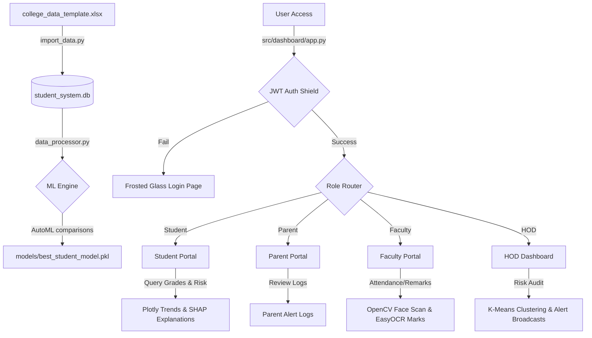
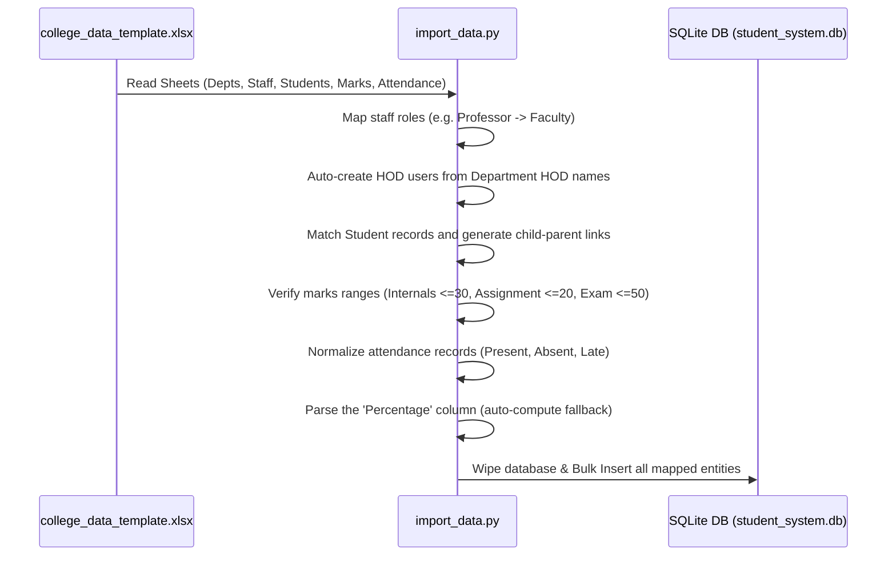
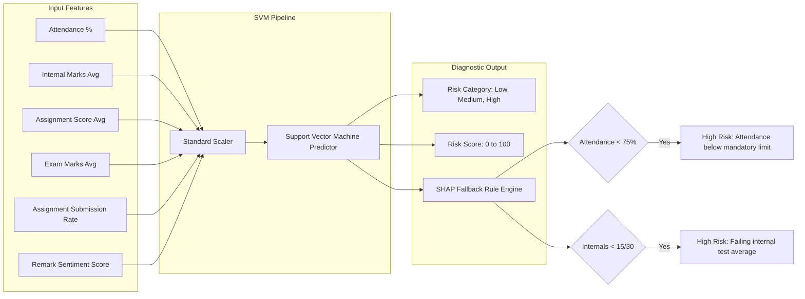
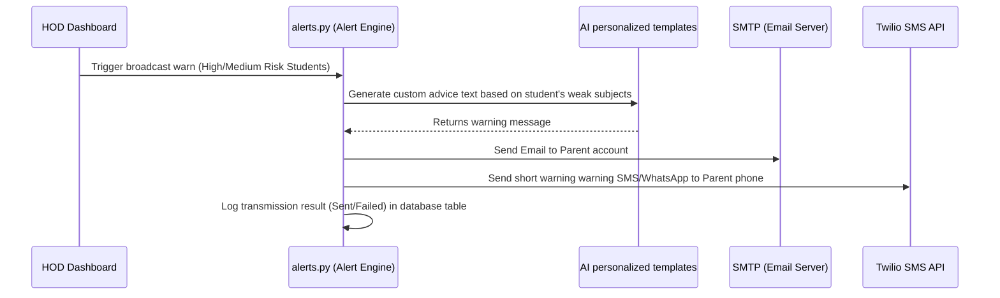

# Project Architecture & Workflow - EduInsight AI

This document details the operational workflow, data pipelines, machine learning logic, and automation sequences of the **EduInsight AI - Student Performance Monitoring & Alert System**.

---

## 1. Core System Architecture

The following flowchart details the end-to-end data and execution workflow:

---

## 2. Component Workflows

### Workflow A: Excel Data Ingestion
This pipeline cleans and populates the system database from the college spreadsheet template:

### Workflow B: ML Risk Prediction & Diagnostic Explainability
This loop determines student risk and translates statistical weights into readable reasons:

### Workflow C: Automation Pipelines (OCR & Face Scan)
The automated workflows run under the Faculty Portal tab:

1.  **Face Scan Classroom Attendance**:
    *   **Input**: Classroom camera image upload or live frame.
    *   **Processing**:
        *   OpenCV Face Cascades locate faces in the grid.
        *   Cross-references face encodings with registered image files in `data/known_faces`.
    *   **Database Write**: Adds a daily `AttendanceRecord` entry marked `Present` for each matched student.
2.  **OCR Report Card Ingestion**:
    *   **Input**: Grade sheet scan upload.
    *   **Processing**: EasyOCR segmenter localizes bounding boxes and reads grade tables.
    *   **Database Write**: Writes structured marks records to `AcademicMarks` for the target student.

---

## 3. Communication & Alert Dispatch Workflow
This engine automatically communicates academic status updates to parents:

---

## 4. Role Navigation Map

### 👨‍🎓 Student Portal
1.  **Visual Metrics**: Gauges overall attendance rate.
2.  **ML Predictions**: View AI Risk Status (Low/Medium/High) and exam pass probability.
3.  **Grades Trend**: Dynamic Plotly bar chart mapping internals, assignments, and exam grades.
4.  **AI Diagnostics**: SHAP-style explanation cards detailing positive and risk-inducing habits.
5.  **Export**: Instantly download a ReportLab-generated PDF Progress Report.

### 👪 Parent Portal
1.  **Ward Status**: Tracks attendance percentage and current academic risk classification.
2.  **Alert log**: Table record showing all emails, SMS, and WhatsApp alerts dispatched to their inbox.

### 👩‍🏫 Faculty Portal
1.  **Manual Grades**: Selectbox select student, input grades (out of 100), update attendance slider, and add behavioral remarks (processed with NLTK sentiment analysis).
2.  **OpenCV Attendance**: Upload classroom images to run face matches.
3.  **OCR Marks**: Parse scanned report cards to auto-populate grade databases.

### 🏛️ HOD Portal
1.  **Overview Cards**: View total enrolled students, average department attendance, and total active high-risk cases.
2.  **Risk Audit Grid**: Interactive table of all student data.
3.  **Broadcast warnings**: Exposes the trigger interface for SMS, WhatsApp, and Email alerts.
4.  **Clustering Map**: Plotly Scatter diagram using K-Means to cluster students into distinct academic classes.
5.  **Performance metrics**: Pass/fail percentages broken down by subject.
